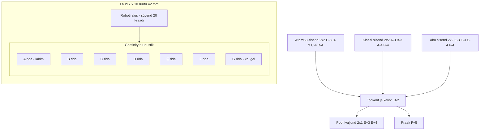

### Enne kui paned printima - vaata, kas piisavalt palju pinda puutub mudeliga. Kui mudeli seinad on liiga õhukesed, siis lisa brim 5mm (5mm prob normaalne) mudelile. 

### Kui teed gridfinity jaoks ruutude paigutamiseks mudeli, siis see peab kinnituma nurgade peale (45 kraadi). Kui all on jalad olemas ja üleval pind ilma nurgata - siis tuleb halvasti välja. 

### Kui tahad lisada supporti (puud), ava prusa sliceris print settings -> support material -> style -> organic. Aga pane enne seda paremalt ülevalt Normal mode peale.

# Labor 2 — protsess ja paigutus

See fail on labori 2 analüüsi alus: sisendid, töökohad, väljundid ja iga hoidiku ruut.
Allikas: [`../Readme.md`](../Readme.md), [`../MG 400 rakis.md`](../MG%20400%20rakis.md).

> **KAARDISTA ISE.** Tabelites on nominaal (õppejõu antud / eeldatud) ja tühi lahter
> tegeliku nihikuga mõõdetud väärtuse jaoks. Täida mõõdetud veerud päris mõõtmistega,
> kirjuta ühikud ja kuupäev. Ära kustuta nominaali — lisa tegelik kõrvale.

## 1. Mõõdud

Mõõdetud nihikuga, ühikud mm. AtomS3 ja Atomi mannekeen on kursuse standard
(24 × 24 × 13 mm). Akumoodul on ruudukujuline, sama põhi kui AtomS3, aga 18 mm kõrge.

| Detail | Nominaal (L × W × H, mm) | Mõõdetud nihikuga (mm) | Märkus |
| :--- | :--- | :--- | :--- |
| AtomS3 | 24 × 24 × 13 | | ekraan ülespoole igas pesas |
| Polükarbonaatklaas | 24 × 24 × 2 | | õhuke, sile, kerge — kõige raskem tõsta |
| Akumoodul | 24 × 24 × 18 | | ruut, sama põhi kui AtomS3, 18 mm kõrge |

### Pesade lõtk (Labor 1 põhjal)

Labor 1 kuubi tulemus: **0,1 mm** oli kinni / liikus suure jõuga, paras oli **≥ 0,2 mm**.
Lõtk ei pea olema kõigil pesadel sama — mida täpsem koht, seda väiksem lõtk ja seda suurem kaldserv.

| Pesa | Kasutatud lõtk (mm) | Labor 1 number, millelt tuli | Põhjendus |
| :--- | :--- | :--- | :--- |
| Sisend | | 0,1 / 0,2 | lõtk 1–2 mm + 45° kaldserv ülal |
| Töökoht | | 0,1 / 0,2 | detail peab paigal seisma; väike lõtk, suur kaldserv |
| Väljund | | 0,1 / 0,2 | robot paneb ebatäpsemalt; suurem kaldserv |

## 2. Protsess

Sildi kokkupanek on tootmisliin: sisend → töökohad → väljund.
Kirjuta sammud ja otsusta iga sammu kohta, kas ta vajab oma töökohta.

| # | Samm | Vajab oma töökohta? | Miks |
| :--- | :--- | :--- | :--- |
| 1 | Võta klaas sisendist | ei | algab sisendist |
| 2 | Aseta klaas Atomi peale (töökoht) | jah | siin toimub operatsioon (klaasi asetamine) |
| 3 | Võta valmis ese töökohalt | ei | sama töökoht |
| 4 | Viit väljundisse | ei | lõpeb väljundis |

**Töökohad:** selle labori testi jaoks piisab **ühest** töökohast (B-2).
Paigutus jätab ruumi, kuhu järgmiste laborite töökohad (nt liimimine, pressimine) tulevad:
vaata jaotist „Paigutus" ja vabu ruute.

**Väljundid:** kaks — **põhiväljund** (vähemalt 4 detailile) ja **praak**.
Praak ei ole erand: kui praagil kohta ei ole, jääb ta töökohale ja liin seisab.

## 3. Paigutus — iga hoidiku ruut

Reegel: sisend ühel pool (numbrid −5…−3), töökoht keskel (tähed A–C, −2…+2),
väljund teisel pool (numbrid +3…+5). Käsi liigub protsessis ühes suunas.

| Hoidev osa | Ruut / ruudud | Suurus ruutudes | Tsoon | r J1-st (mm) |
| :--- | :--- | :--- | :--- | :--- |
| Klaasi sisendhoidik | A-3, B-3, A-4, B-4 | 2 × 2 | sisend | 175–234 |
| AtomS3 sisendhoidik | C-3, D-3, C-4, D-4 | 2 × 2 | sisend | 247–303 |
| Akumooduli sisendhoidik | E-3, F-3, E-4, F-4 | 2 × 2 | sisend | 325–379 |
| Töökoha hoidik | B-2 | 1 × 1 | töökoht | 192 |
| Kalibreerimishoidik (1 × 1) | B-2 | 1 × 1 | kalibreerimine | 192 |
| Põhiväljundi hoidik (4-le) | E+3, E+4 | 2 × 1 | väljund | 325 / 341 |
| Praagi hoidik | F+5 | 1 × 1 | väljund | 397 |

Kõik sisendhoidikud hoiavad **vähemalt 4 ühikut**; ~24 mm detailide puhul ei mahu 4 pesa
1 × 1 ruutu, seega on need **2 × 2** (välismõõt 83,5 × 83,5 mm). Töökoht ja praak on 1 × 1
(41,5 × 41,5 mm), põhiväljund 2 × 1 (83,5 × 41,5 mm).

Vabad ruudud järgmisteks laboriteks (nt kaks kaamerat, lisatöökohad): number −5 veerg
(A-5…F-5) ja +poolel keskmised ruudud (D+1…F+1). Jäta roboti liikumistee (kahe hoidiku
vaheline otsetee) vabaks: kaks hoidikut, mille vahel käsi risti üle kolmanda käib, ei ole hea paigutus.

### Roboti ulatuse kontroll

| Kontroll | Reegel | Tulemus |
| :--- | :--- | :--- |
| Kõik ruudud ≤ 400 mm | jah | sisend 175–379, töökoht 192, väljund 325–397 |
| Väldi G-5, G-4, G-3, G+3, G+4, G+5 | jah | ühtki hoidikut neis ei ole (ainult F+5 = 397, OK) |
| J1 ±160° pööre | jah | kõik ruudud esiküljel |
| Kõrged osad (> 60 mm) eemale käe teelt | jah | hoidikud madalad; kaamerapost eraldi (osa 5) |

## 4. Ülaltvaade

Skeem on mudeli koordinaatides (J1 = 0,0). A on robotile kõige lähemal, G kõige kaugemal.
Pluss on operaatori vasakul, kui seista näoga roboti poole.

Numbrite külg: − vasakul (operaatori parem), + paremal (operaatori vasak).
Ruudul 0 ei ole — nulljoon jookseb kahe ruudu vahelt.

## 5. Kalibreerimine

Vt protseduur [`../MG 400 rakis.md`](../MG%20400%20rakis.md) §7.

| Samm | Väärtus |
| :--- | :--- |
| Kalibreerimishoidik ruudus | B-2 |
| Arvutatud keskpunkt (valem §4) | x = −181,5 mm, y = −63,0 mm |
| Mõõdetud roboti koordinaadid | |
| **Nihe = mõõdetud − arvutatud** | |
| Kaugele ruudu (E+3) viga | |
| Z referents (ruudustiku pealispind) | |

Kui kauge ruudu viga > 1 mm, on telgede suund valesti eeldatud (X_robot = −x, Y_robot = −y),
mitte hoidik vale. Kõik hilisemad õpetused kirjuta kujul **ruut + nihe**, mitte toored koordinaadid.

## 6. Viited

- Gridfinity ruudustik ja koordinaadid: [`../MG 400 rakis.md`](../MG%20400%20rakis.md) §4–§5
- Kalibreerimise protseduur: [`../MG 400 rakis.md`](../MG%20400%20rakis.md) §7
- Labor 1 lõtk ja painde numbrid: [`../../lab1/README.md`](../../lab1/README.md)
